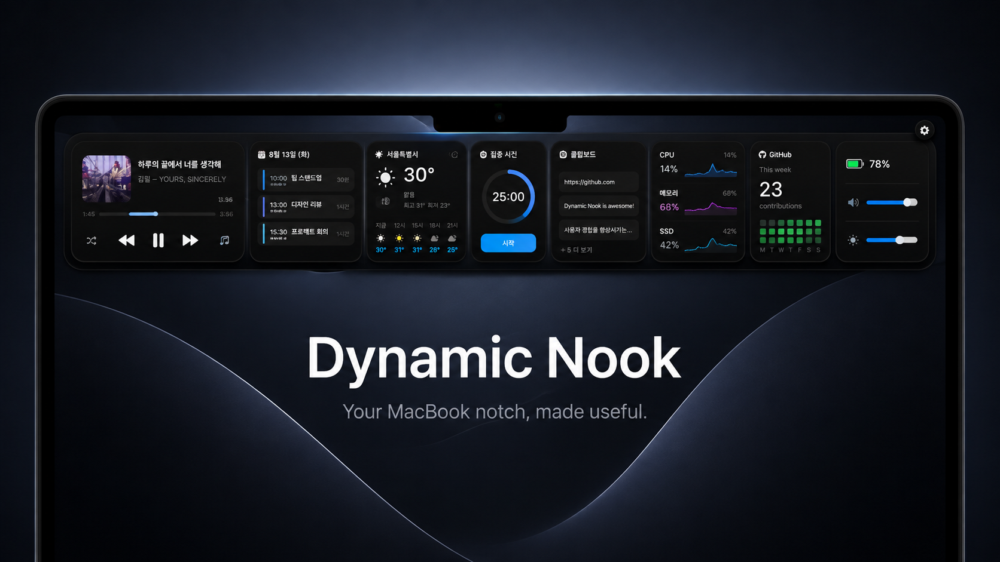

<div align="center">



# Dynamic Nook

**MacBook 노치를 쓸모 있게.**

MacBook 노치를 사용자 지정 대시보드, 시스템 제어 공간, 임시 파일 트레이로 바꾸는 네이티브 macOS 유틸리티입니다.

**한국어** · [English](README.en.md)


[](https://github.com/HAHEONHWI/Dynamic-nook/releases/download/v1.0.5/Dynamic-Nook-1.0.5.dmg)

</div>

> [!NOTE]
> Dynamic Nook는 현재 Mac App Store가 아닌 직접 배포용 베타 버전이며, 비상업적 용도로만 사용할 수 있는 source-available 소프트웨어입니다.

## 주요 기능

- **다이내믹 노치:** 호버, 클릭, 스와이프로 노치를 펼칩니다. 시스템 미디어는 재생 제어가 포함된 작은 다이내믹 아일랜드로 표시할 수 있습니다.
- **사용자 지정 Nook 페이지:** 페이지 추가·삭제, 원하는 페이지에 위젯 배치, 순서와 셀 크기 변경, 마지막으로 열었던 페이지 복원이 가능합니다.
- **파일 트레이:** 파일을 노치에 놓으면 앱의 임시 저장소로 이동합니다. 다시 드래그하거나 Finder에서 열고, 공유·AirDrop·원래 위치 복원이 가능합니다.
- **시스템 통합:** 오디오 출력, 디스플레이, 밝기, 잠자기 방지, 창 배치, 배터리, 연결 기기를 제어하거나 확인합니다.
- **한글·영어 지원:** 기본값은 시스템 언어이며 지원하지 않는 언어는 영어로 표시합니다.

## 위젯

| 생산성 | 시스템 | 정보 |
| --- | --- | --- |
| 캘린더와 가장 가까운 다음 일정 | 미디어 플레이어 | 날씨와 6시간 예보 |
| 미리 알림과 빠른 추가 | 오디오 출력·볼륨 | 컴시간 시간표 / NEIS 급식·학교 일정 |
| 집중 타이머 | 디스플레이 제어 | 네트워크·Wi-Fi·VPN·공인 IP |
| 일반 타이머·스톱워치 | 잠자기 방지 | 환율·국내·미국 주식 |
| 마크다운 메모 | CPU·메모리·디스크 사용량 | GitHub 잔디·로컬 Git 상태 |
| 단축어·빠른 실행 | 배터리·전원 | Bluetooth·USB·외장 드라이브 |
| 클립보드 기록 | 창 배치 | 카메라 미러 |

## 설치

1. [Dynamic Nook 1.0.5 DMG 다운로드](https://github.com/HAHEONHWI/Dynamic-nook/releases/download/v1.0.5/Dynamic-Nook-1.0.5.dmg)를 누릅니다.
2. DMG를 열고 **Dynamic Nook.app**을 **Applications**로 드래그합니다.
3. Dynamic Nook를 실행하고 사용하는 위젯에 필요한 권한만 허용합니다.

업데이트할 때는 Dynamic Nook를 종료한 뒤 새 DMG의 앱으로 Applications 안의 기존 앱을 대치합니다. 위젯 설정은 `UserDefaults`, 비밀 정보는 Keychain에 남아 유지됩니다.

> [!WARNING]
> Developer ID 서명과 Apple notarization이 없는 빌드는 다른 Mac에서 Gatekeeper에 차단될 수 있습니다. 저장소의 로컬 빌드는 Apple Development 인증서를 사용할 수 있지만, 공개 배포에는 `Developer ID Application` 서명과 notarization이 필요합니다.

## 권한과 개인정보

권한 페이지에서 현재 상태를 확인하고 권한 요청 또는 해당 시스템 설정을 열 수 있습니다.

- **캘린더 / 미리 알림:** 일정 조회와 미리 알림 완료 처리에 사용합니다.
- **위치:** 현재 위치의 날씨를 가져옵니다. 거부해도 수동 장소를 입력할 수 있습니다.
- **카메라:** 미러 위젯이 보일 때만 사용합니다.
- **손쉬운 사용:** 창 배치 기능에만 필요합니다.
- **자동화:** 시스템 미디어 제어를 사용할 수 없을 때 Apple Music 제어에 사용합니다.
- **클립보드:** 최근 20개를 메모리에만 저장하며 앱을 재시작하면 삭제됩니다. 비밀번호처럼 보이는 내용은 제외합니다.
- **NEIS:** API 키는 로컬 Keychain에 저장하며 소스 코드에 넣지 않습니다. [NEIS API 키 발급](https://open.neis.go.kr/portal/guide/actKeyPage.do).
- **GitHub:** 공개 프로필과 잔디만 조회합니다. GitHub 토큰을 저장하지 않으며 비인증 API 제한이 적용됩니다.

## 기술 구성

- Swift 6, SwiftUI, AppKit, SwiftPM
- macOS 14.6 이상
- EventKit, CoreLocation, CoreAudio, IOKit, Accessibility, CoreWLAN
- 날씨: Open-Meteo, 학교 정보: 컴시간 알리미·NEIS
- 주식: Yahoo Finance 차트 데이터, 환율: Frankfurter
- macOS System Now Playing: 런타임에 불러오는 `MediaRemote.framework`

Private API 코드는 Service·Bridge 계층에 격리하고 안전하게 런타임 로딩하며, 실패해도 앱이 종료되지 않도록 fallback을 사용합니다. macOS 업데이트 후 유지보수가 필요할 수 있습니다.

## 빌드와 테스트

```bash
./script/build_and_run.sh --verify
DEVELOPER_DIR=/Applications/Xcode.app/Contents/Developer xcrun swift test
```

실행 스크립트는 `dist/nook3h.app`을 만들고, 가능한 경우 Apple Development 인증서로 서명한 뒤 실행과 프로세스를 검증합니다.

## DMG 만들기

```bash
./script/create_dmg.sh
```

산출물: `dist/Dynamic-Nook-1.0.5.dmg`

공개 직접 배포용 빌드:

```bash
SIGN_IDENTITY="Developer ID Application: Your Name (TEAMID)" \
NOTARY_PROFILE="notarytool-profile" \
./script/create_dmg.sh
```

스크립트는 `Assets/DMG/DMGBackground.png`를 사용해 Applications 드래그 설치 화면을 만들고 최종 디스크 이미지를 검증합니다.

## 현재 상태

Dynamic Nook **1.0.5**입니다. 핵심 기능은 동작하지만 Private Framework, DDC/CI 디스플레이, 하드웨어별 덮개 잠자기 방지, 미공증 배포 동작은 Mac과 macOS 버전에 따라 달라질 수 있습니다.

## 라이선스

[PolyForm Noncommercial License 1.0.0](LICENSE)으로 배포합니다. 개인 학습·연구·취미 등 비상업적 사용과 변경·재배포만 허용됩니다. 상업적 사용은 저작권자의 별도 서면 허가가 필요합니다.

Copyright © 2026 Ha HeonHwi
